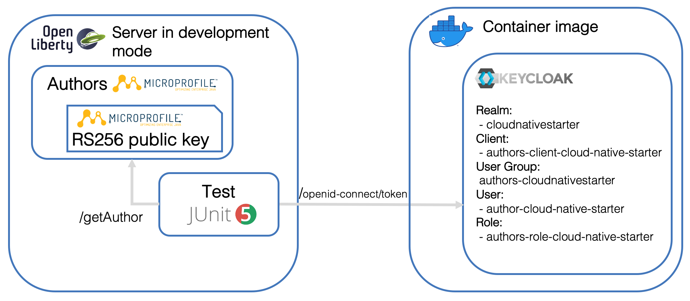
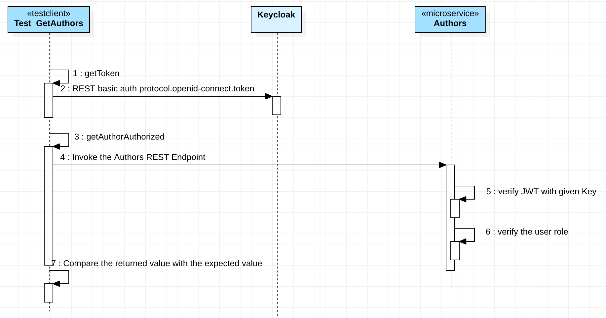

# Get started with a Java Microservice using Keycloak, MicroProfile and OpenLiberty

### Objective

The objective of this project is to provide a _"simple"_ example to access a Java microservice using the [_Open Source Identity and Access Management_ Keycloak](https://www.keycloak.org) and [JavaWebToken (JWT)](https://jwt.io).

We want to ...
  * ... secure the microservice application with a login
  * ... secure a specific REST Endpoint invocation of the microservice with a role
  * ... test the access to the microservice with a [JUnit](https://junit.org/junit5/) test.

The microservice runs on [OpenLiberty](https://openliberty.io/) and uses [MicroProfile](https://microprofile.io/). The example microservice is called `Authors` and is from the open sourced [Cloud Native Starter project](https://github.com/IBM/cloud-native-starter).

### Architecture

The `Authors` microservice application supports a protected logon with a JWT and the specific REST call `getAuthors` is protected by a specific user role. The image below contains a simpified architecture overview of the example which runs on the local machine, here you see:

* The `JUnit` test and Authors microservice are running on `OpenLiberty`
* The needed `JWT` Key is saved on the OpenLiberty server in a MicroProfile configuration
* The `JUnit` test requests a `bearer token` to access the `Authors` service
* The major configuration information inside `Keycloak`

A very simplified overview of the test execution to access `Authors` microservice using `Keycloak`, `OpenLiberty`, `MicroProfile` and `JWT` , is shown in the sequence diagram below.

  1. Start the `JUnit` test called `Test_GetAuthors`. The test invokes the private operation `getToken`.
  2. Request a bearer token from `Keycloak` using a REST Endpoint (http://localhost:8282/auth/realms/protocol/openid-connect/token). The request contains the needed Keycloak data for the authorization as a parameters to get the `bearer token`.That `bearer token` does contain the `Java Web Token`, which is protected with the `RS256 (RSA Signature with SHA-256)`. `RS256` is a [JWT](https://en.wikipedia.org/wiki/JSON_Web_Token) signing algorithm. 
  3. Proceeding with the test by invoking the private operation `getAuthorAuthorized`.
  4. Now the `Authors` REST Endpoint (http://localhost:3000/api/v1/getAuthor) is invoked using the bearer token we got from Keycloak, which contains the [JWT](https://en.wikipedia.org/wiki/JSON_Web_Token).
  5. Verifing the JWT Key by the `Authors` microservice application, that will be done automaticly, by using the given `RS256 signed JWT Key` on the `OpenLiberty` server. When the provided Key is valied, the JWT can be used to access the REST Endpoint of the microservice.
  6. Now the Endpoint validates, does the `JavaWebToken contain the right role to access the information?
  7. Then the response data data will be compared with the expected value.

### Setup overview

* [**Keycloak**](https://www.keycloak.org)

  For the setup of [Keycloak](https://www.keycloak.org) 
  we need ...

    1. ... run a local Keycloak Docker image
    2. ... add a [realm](https://www.keycloak.org/docs/latest/getting_started/index.html#creating-a-realm-and-user)
    3. ... import an existing realm configuration with:

        * Realm Keys
        * Client definition
        * Role and Group definition
        * Groups role mapping      
    4. ... create a user and add him to the existing group with the role to add the microservice

* [**OpenLiberty**](https://openliberty.io/) and [**MicroProfile**](https://microprofile.io/)

  For the setup of the Java microservice with [**OpenLiberty**](https://openliberty.io/) and [**MicroProfile**](https://microprofile.io/) with the [**JUnit**](https://junit.org/junit5/) test, it's useful to understand the steps from the blog post ["Write and execute a JUnit test for a Java microservice based on MicroProfile and run both in the OpenLiberty development mode"](https://suedbroecker.net/2020/03/04/write-and-execute-a-junit-test-for-a-java-microservice-based-on-mircoprofile-and-run-both-in-the-openliberty-development-mode/).

  We need to ...

    1. ... configure the `server.xml` of OpenLiberty
    2. ... add logon and security functionality to the `AuthorsApplication` class
    3. ... secure the REST Endpoint in the `GetAuthor`class

* [**JUnit test**](https://junit.org/junit5/)

  We need to ...

    1. ... use the two-factor authentication to access the `Authors` microservice
    2. ... use a REST a client to send the requests to the `Authors` microservice and Keycloak
    3. ... verify `Authors` microservice response in the JUnit test

### Technologies Used

* [**Jakarta EE**](https://jakarta.ee/)
* [**MicroProfile**](https://microprofile.io/)
* [**OpenLiberty**](https://openliberty.io/)
* [**Keycloak**](https://www.keycloak.org)
* [**Microservices architecture**](https://en.wikipedia.org/wiki/Microservices)
* [**JUnit**](https://junit.org/junit5/)
* [**Java Web Token**](https://de.wikipedia.org/wiki/JSON_Web_Token)
* [**Docker**](https://www.docker.com)
* [**Keycloak**](https://www.keycloak.org)

### Compatibility

This project has been created by using following technical environment:

* Development environment:
  * [**Docker Desktop:**](https://www.docker.com) version 2.3
  * [**MacOS:**](https://www.apple.com/macos/catalina/): 10.15.5 OS Catalina
  * [**Visual Studio Code**](https://code.visualstudio.com) with the [Java extension Pack](https://marketplace.visualstudio.com/items?itemName=vscjava.vscode-java-pack)

* Java project:
  * [**OpenLiberty**](https://openliberty.io): version 20.0.0.6
  * [**Keycloak**](https://www.keycloak.org): version 9.0.2
  * [**MicroProfile**](https://microprofile.io/): version 3.2
  * [**Glassfish**](https://javaee.github.io/glassfish/): version 1.1
  * [**yasson**](https://projects.eclipse.org/projects/ee4j.yasson): version 1.0
  * [**JUnit**](https://junit.org/junit5/): version 5.6.0
  * [**OpenLiberty Maven Plugin**](https://openliberty.io/blog/2019/11/28/dev-mode-liberty-maven-plugin.html): version 3.1
  * [**Apache Maven Compiler Plugin**](https://maven.apache.org/plugins/maven-compiler-plugin/): version 3.1
  * [**Maven Surefire Plugin**](http://maven.apache.org/surefire/maven-surefire-plugin/): version 2.22.2
  * [**Apache CXF MicroProfile Client:**](https://mvnrepository.com/artifact/org.apache.cxf/cxf-rt-rs-mp-client) version 3.3.1
  * [**Maven Java Compiler:**](https://maven.apache.org/plugins/maven-compiler-plugin/examples/set-compiler-source-and-target.html): version 1.8

