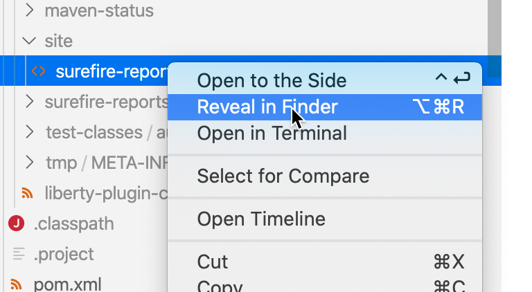
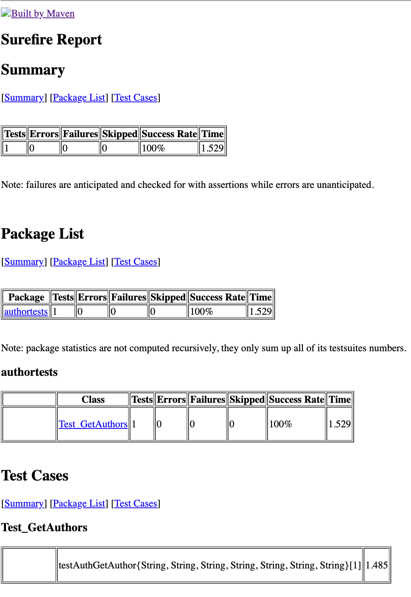

# Start the Microservice and execute the test

### STEP 1: 

Reminder: Setup, configure and run the `Keycloak server` [here](../../setup-01/README.md).

### STEP 2:

Open a terminal in the GitHub project folder. Start the OpenLiberty server in the devepment mode `liberty:dev`.

```sh
$ cd authors-java-jee
$ mvn clean
$ mvn liberty:dev
```

### STEP 3:

Run the JUnit test, by just pressing return button in the terminal console.

```sh
$ [INFO] CWWKM2015I: Match number: 1 is [29/06/2020, 09:06:00:531 CEST] 00000038 com.ibm.ws.kernel.feature.internal.FeatureManager            A CWWKF0011I: The authorsDevJUnitServer server is ready to run a smarter planet. The authorsDevJUnitServer server started in 9.951 seconds..
[INFO] Press the Enter key to run tests on demand.
```

Here we see the relevant output in the terminal session.

1. First we see that we get the bearer token from Keycloak (we can use that token to verify the content with a [JWT Decoder](http://jwt.io) on the web).
2. Then we see that the bearer token content information also from the Authors Microservice output.
3. Now we see the return value of the Authors Microservice is going to send.
4. Now JUnit test shows the value of the Authors response we going to compare with expected value in the test.
5. As the last output we see JUnit test result.

In the output `[JUNIT-TEST]` indicates outputs from the JUnit test and `[INFO] ... [Author]` indicates the outputs of the Microservice Authors.

```sh
[INFO] Running unit tests...
[INFO] 
[INFO] -------------------------------------------------------
[INFO]  T E S T S
[INFO] -------------------------------------------------------
[INFO] Running authortests.Test_GetAuthors
[JUNIT-TEST] -> Start get Token
[JUNIT-TEST] -> Keycloak getToken response has entity: true
[JUNIT-TEST] -> keycloakToken : eyJhbGciOiJSUzI1NiIsInR5cCIgOiAiSldUIiwia2lkIiA6ICJ1aFJjRWZ1aVBLRGozcjhDMHlpYXB3cFlpX295VjFLVGVzQndreXFsSGtNIn0.eyJleHAiOjE1OTM0MTU0MTUsImlhdCI6MTU5MzQxNTExNSwianRpIjoiMmJjY2FhYzQtYWE5Yy00MDI5LWEyMWItYTI5NDNkZjI0MjRkIiwiaXNzIjoiaHR0cDovL2xvY2FsaG9zdDo4MjgyL2F1dGgvcmVhbG1zL2Nsb3VkbmF0aXZlc3RhcnRlciIsImF1ZCI6ImFjY291bnQiLCJzdWIiOiJhZWYxYmQ3NC1kZThjLTRlY2MtOWJlMi0xN2FlZWVjNTc3OGYiLCJ0eXAiOiJCZWFyZXIiLCJhenAiOiJhdXRob3JzLWNsaWVudC1jbG91ZC1uYXRpdmUtc3RhcnRlciIsInNlc3Npb25fc3RhdGUiOiIxYjlmMTJiYy0wZjE5LTRmZWMtOTBhYi0zNGJkNzQ3OTBiYWQiLCJhY3IiOiIxIiwicmVhbG1fYWNjZXNzIjp7InJvbGVzIjpbIm9mZmxpbmVfYWNjZXNzIiwiYXV0aG9ycy1yb2xlLWNsb3VkLW5hdGl2ZS1zdGFydGVyIiwidW1hX2F1dGhvcml6YXRpb24iXX0sInJlc291cmNlX2FjY2VzcyI6eyJhY2NvdW50Ijp7InJvbGVzIjpbIm1hbmFnZS1hY2NvdW50IiwibWFuYWdlLWFjY291bnQtbGlua3MiLCJ2aWV3LXByb2ZpbGUiXX19LCJzY29wZSI6InByb2ZpbGUgZW1haWwiLCJlbWFpbF92ZXJpZmllZCI6ZmFsc2UsImdyb3VwcyI6WyJvZmZsaW5lX2FjY2VzcyIsImF1dGhvcnMtcm9sZS1jbG91ZC1uYXRpdmUtc3RhcnRlciIsInVtYV9hdXRob3JpemF0aW9uIl0sInByZWZlcnJlZF91c2VybmFtZSI6ImF1dGhvci1jbG91ZC1uYXRpdmUtc3RhcnRlciJ9.HyF5YKBpokVSTPgLggq9GF5BTKJE45nL3ESxp0Qng9VIYI8jalMOGr08jH3WlxkBphP1aO79yvn-fjGLLQn-XctlNsevgs6lkeJf9gjBVnub13ufu_RMi4XLrXaAdU7Ib_AXSA_wfxkclqCT7tAJyPlWOWaVW7hP5pHhSfOcm0-ho89GUFf_E1P8JsHmCfy87IuY236dZ5jI6vDBcokg8VP5UrDRq_q_9wbQzw-xtsJmPm-9TIvD1okvAX3wX9_AbnVaflVVLE0fC-f46xXEprZwVCe-I-9m-X04DYznIYMAGWSjU2vnGCoJuPXR3xAQOXCjBcqmmLP-51oxA9iDFg
[INFO] ... [Author] MP JWT getIssuedAtTime 1593415115
[INFO] ... [Author] getIssuer: http://localhost:8282/auth/realms/cloudnativestarter
[INFO] ... [Author] getRawToken: eyJhbGciOiJSUzI1NiIsInR5cCIgOiAiSldUIiwia2lkIiA6ICJ1aFJjRWZ1aVBLRGozcjhDMHlpYXB3cFlpX295VjFLVGVzQndreXFsSGtNIn0.eyJleHAiOjE1OTM0MTU0MTUsImlhdCI6MTU5MzQxNTExNSwianRpIjoiMmJjY2FhYzQtYWE5Yy00MDI5LWEyMWItYTI5NDNkZjI0MjRkIiwiaXNzIjoiaHR0cDovL2xvY2FsaG9zdDo4MjgyL2F1dGgvcmVhbG1zL2Nsb3VkbmF0aXZlc3RhcnRlciIsImF1ZCI6ImFjY291bnQiLCJzdWIiOiJhZWYxYmQ3NC1kZThjLTRlY2MtOWJlMi0xN2FlZWVjNTc3OGYiLCJ0eXAiOiJCZWFyZXIiLCJhenAiOiJhdXRob3JzLWNsaWVudC1jbG91ZC1uYXRpdmUtc3RhcnRlciIsInNlc3Npb25fc3RhdGUiOiIxYjlmMTJiYy0wZjE5LTRmZWMtOTBhYi0zNGJkNzQ3OTBiYWQiLCJhY3IiOiIxIiwicmVhbG1fYWNjZXNzIjp7InJvbGVzIjpbIm9mZmxpbmVfYWNjZXNzIiwiYXV0aG9ycy1yb2xlLWNsb3VkLW5hdGl2ZS1zdGFydGVyIiwidW1hX2F1dGhvcml6YXRpb24iXX0sInJlc291cmNlX2FjY2VzcyI6eyJhY2NvdW50Ijp7InJvbGVzIjpbIm1hbmFnZS1hY2NvdW50IiwibWFuYWdlLWFjY291bnQtbGlua3MiLCJ2aWV3LXByb2ZpbGUiXX19LCJzY29wZSI6InByb2ZpbGUgZW1haWwiLCJlbWFpbF92ZXJpZmllZCI6ZmFsc2UsImdyb3VwcyI6WyJvZmZsaW5lX2FjY2VzcyIsImF1dGhvcnMtcm9sZS1jbG91ZC1uYXRpdmUtc3RhcnRlciIsInVtYV9hdXRob3JpemF0aW9uIl0sInByZWZlcnJlZF91c2VybmFtZSI6ImF1dGhvci1jbG91ZC1uYXRpdmUtc3RhcnRlciJ9.HyF5YKBpokVSTPgLggq9GF5BTKJE45nL3ESxp0Qng9VIYI8jalMOGr08jH3WlxkBphP1aO79yvn-fjGLLQn-XctlNsevgs6lkeJf9gjBVnub13ufu_RMi4XLrXaAdU7Ib_AXSA_wfxkclqCT7tAJyPlWOWaVW7hP5pHhSfOcm0-ho89GUFf_E1P8JsHmCfy87IuY236dZ5jI6vDBcokg8VP5UrDRq_q_9wbQzw-xtsJmPm-9TIvD1okvAX3wX9_AbnVaflVVLE0fC-f46xXEprZwVCe-I-9m-X04DYznIYMAGWSjU2vnGCoJuPXR3xAQOXCjBcqmmLP-51oxA9iDFg
[INFO] ... [Author] getTokenID: 2bccaac4-aa9c-4029-a21b-a2943df2424d
[INFO] ... [Author] Requested input name: Niklas
[INFO] ... [Author] Requested name: Niklas
[INFO] ... [Author] send getAuthor response: {"blog":"https://twitter.com/nheidloff","name":"Niklas Heidloff","twitter":"http://heidloff.net"}
[JUNIT-TEST] -> getAuthorAuthorized response status: 200
[JUNIT-TEST] -> getAuthorAuthorized response has entity: true
[JUNIT-TEST] -> Get Author response has 'data': {"blog":"https://twitter.com/nheidloff","name":"Niklas Heidloff","twitter":"http://heidloff.net"}
[JUNIT-TEST] -> getauthor response: {"blog":"https://twitter.com/nheidloff","name":"Niklas Heidloff","twitter":"http://heidloff.net"}
[JUNIT-TEST] -> Verify: Niklas Heidloff
[INFO] Tests run: 1, Failures: 0, Errors: 0, Skipped: 0, Time elapsed: 1.529 s - in authortests.Test_GetAuthors
[INFO] 
[INFO] Results:
[INFO] 
[INFO] Tests run: 1, Failures: 0, Errors: 0, Skipped: 0
[INFO] 
[INFO] Unit tests finished. 
[INFO] Running integration tests...
[INFO] Integration tests finished.
[INFO] Press the Enter key to run tests on demand.
```

### STEP 4 (optional):

We can open the test report which is created by Maven inside the project.
The image below shows, how to locate the file `junit-surefire-test-result` of the test report and open the report in a browser.



The test report.



__Congratulations! We’ve finished the example!__
