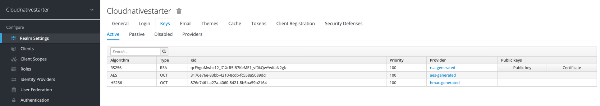

# Setup Keycloak

In this part we will setup Keycloak. We will run a local Keycloak Docker container and reuse an existing realm configuration.

The image below shows the relevant elements we will use later.


---

### Step 1: Clone the project to your local machine

```sh
git clone https://github.com/thomassuedbroecker/get-started-with-keycloak-microprofile-openliberty.git
cd get-started-with-keycloak-microprofile-openliberty
ROOT_FOLDER=$(pwd)
```

### Step 2: Start Keycloak Docker image local

Open a terminal session and enter:

```sh
docker run -it -e KEYCLOAK_USER=admin -e KEYCLOAK_PASSWORD=admin -p 8282:8080 jboss/keycloak:9.0.2
```
### Step 2: Import the existing realm configuration

1. Open the Keycloak in a browser select the Administration Console

Use following URL:

```sh
http://localhost:8282/
```


2. Login to using the URL in your browser with `user/admin` and `password/admin`

3. Select _Add realm_


3. Choose for import _Select file_


4. Select existing [`realm`](https://en.wikipedia.org/wiki/Realm) configuration from folder `/keycloak-realm-exports/cloud-native-starter-author-local-realm-export.json`


5. Press _Create_


### (Optional) Step 3: Verify the imported realm `cloudnativestarter`

#### (Optional) Realm 

The **realm** `cloudnativestarter` uses a [OpenID Endpoint configuration.](https://www.keycloak.org/docs/latest/securing_apps/#openid-connect-2).


#### (Optional) Realm keys

The Key has the [JavaWebToken (JWT)](https://en.wikipedia.org/wiki/JSON_Web_Token) format and uses the _RS256 asymmetric algorithm_.

> _"RS256 (RSA Signature with SHA-256) is an asymmetric algorithm, and it uses a public/private key pair: the identity provider has a private (secret) key used to generate the signature, and the consumer of the JWT gets a public key to validate the signature. Since the public key, as opposed to the private key, doesn't need to be kept secured, most identity providers make it easily available for consumers to obtain and use (usually through a metadata URL)."_ [Resource of this text](https://stackoverflow.com/questions/39239051/rs256-vs-hs256-whats-the-difference)



#### (Optional) Client

Definition of the `authors-cloud-native-starter` client.


#### (Optional) Client scope


#### (Optional) Roles

Definition of the role `authors-role-cloud-native-starter`.


#### (Optional) Groups

Definition of the group `authors-cloud-native-starter`.


#### (Optional) Groups role mapping

The definition of the role `authors-role-cloud-native-starter` to the group `authors-cloudnativestarter` mapping.


### Step 5: Add a user

#### 1. Set Username: `author-cloud-native-starter`
 


#### 2. Set Password: `1234`


#### 3. Turn off _temporary_


#### 4. Remove in the tab Details the _Required User Action_ **Update Password**


### Step 6: Add user to Group

Select in user _Author-cloud-native-starter_ the tab Groups and join in _Available Groups_
the _authors-cloudnativestarter_.


