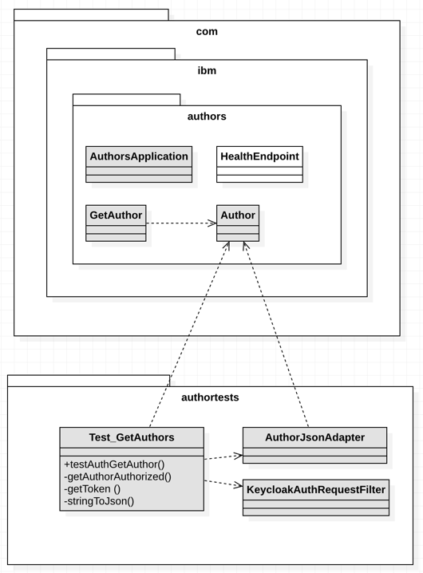
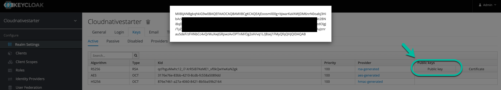

# Setup Authors Microservice on OpenLiberty

### Overview

We need to verify following relevant classes for the usage of JWT with MicroProfile:

* `AuthorsApplication` Java class
* `GetAuthor` Java class
* `server.xml` for the OpenLiberty server

We have to insert the public RS256 signed JWT Key from Keycloak  in following file `src/main/webapp/META-INF/keycloak-public-key.pem`.
MicroProfile uses the file `microprofile-config.properties` to get the location of the key information.

### Overview of the classes

* `AuthorsApplication` class represents our RESTful application and is configured to use login with JWT.
* `GetAuthor` class represents the REST API Endpoint, which is protected JWT security, defined by a specific role.
* `Author` class represents the data structure we use for the Author and is also used in the test.
* `HealthEndpoint`class is responsible for Kubernetes provides liveness and readiness probes, when we would deploy the Microservice to Kubernetes.

The simplified classdiagram shows an overview of classes of our project, for the Microservice and the JUnit test.



---

### Step 1: **Verify** the modifications in the Authors Microservice

With [`org.eclipse.microprofile.auth.LoginConfig`](https://www.eclipse.org/community/eclipse_newsletter/2017/september/article3.php) and `@LoginConfig(authMethod = "MP-JWT")` we add the JWT authenication to the RESTful application and with [`javax.annotation.security.DeclareRoles`](https://docs.oracle.com/cd/E19798-01/821-1841/gjgcq/index.html) and @DeclareRoles({"authors-role-cloud-native-starter"}) we define the roles, which can be used in the Microservice application to enable protection.

* `AuthorsApplication` class

```java
import org.eclipse.microprofile.auth.LoginConfig;
import javax.annotation.security.DeclareRoles;

@LoginConfig(authMethod = "MP-JWT")
@DeclareRoles({"authors-role-cloud-native-starter"})
```

* `GetAuthor` class

In that class we protect the invocation of the REST Endpoint with the role `@RolesAllowed({"authors-role-cloud-native-starter"})` and we show the content of the JWT content later.

```java
import javax.annotation.security.RolesAllowed;
import org.eclipse.microprofile.jwt.JsonWebToken;
import javax.inject.Inject;

....

	@Inject private JsonWebToken tokenInformation;
  @RolesAllowed({"authors-role-cloud-native-starter"})
  
....
  
  if (tokenInformation != null){
				System.out.println("... [Author] MP JWT config message: " + message );
				System.out.println("... [Author] MP JWT getIssuedAtTime " + tokenInformation.getIssuedAtTime() );
				System.out.println("... [Author] getIssuer: " + tokenInformation.getIssuer());
				System.out.println("... [Author] getRawToken: " + tokenInformation.getRawToken());
				System.out.println("... [Author] getTokenID: " + tokenInformation.getTokenID());
	}
```

---

### Step 2: **Verify** the modification of the Liberty `server.xml`

We define the configuration for the JWT. We need to ensure that we find the values for the issuer, audiences, userNameAttribute our JWT. Below is an extract to the JWT content and a the table with the mapping:

|  JWT | OpenLiberty server.xml  |
| - | - |
| iss | issuer |
| aud | audiences |
| preferred_username | userNameAttribute |

```json
  "iss": "http://localhost:8282/auth/realms/cloudnativestarter", (issuer)
  "aud": "account", (audiences)
  "preferred_username": "author-cloud-native-starter" (userNameAttribute)
```

The issuer, audiences, userNameAttribute must be mapped to your server.xml file. [Here you find the definitions](https://openliberty.io/docs/ref/config/mpJwt.html) OpenLiberty expects in a JWT.

This is an extract of the `server.xml` for our OpenLiberty server:

```xml
  <mpJwt
     id="myMpJwt"
     jwksUri="http://localhost:8282/auth/cloudnativestarter/public/protocol/openid-connect/certs"
     issuer="http://localhost:8282/cloudnativestarter/realms/public"
     userNameAttribute="preferred_username"
     audiences="account">
  </mpJwt>
```

### Step 3: **Insert** the RS256 JWT key in the file `keycloak-public-key.pem` 

The file is saved in that folder `src/main/webapp/META-INF/keycloak-public-key.pem`.

```sh
-----BEGIN PUBLIC KEY-----
YOUR_KEY
-----END PUBLIC KEY-----
```

Your `src/main/webapp/META-INF/keycloak-public-key.pem` file should look like this:

```sh
-----BEGIN PUBLIC KEY-----
MIIBIjANBgkqhkiG9w0BAQEFAAOCAQ8AMIIBCgKCAQEAtnBXdCRtOwh570rp56JBVl/+8KLNuaHbu/xOtzS87RhQ0I3sRC5UfW6Y3/8j2xkVJXTsIT0Zn3DdOr+sb+DtkCVaX/UC4LpJUYcDAIz7I2JjCrJhAbqmhr/nSgJ81+NVF99pW/SyynfG/eOixyc55p62NxsQs1l3rPbFRIWz00iIyFpPVHStYPJcDS749qPfz+N2H2yS2++JVbP3mTchb0tlISXU/j+SDMmUGFKzBTak3z+CBWlvhNlqGyUQM6SmklegUo9pdgq3fXyC2qK8/QG15QurAyezQ5gvU6p7LN8mPn/yZtbED8PBypYrk81E4N470wSuUGRbMM2KTNg4EQIDAQAB
-----END PUBLIC KEY-----
```

We get the public key by using the URL `http://localhost:8282/auth/admin/master/console/#/realms/cloudnativestarter/keys` and then we press **_public key_**. Copy and past the content into the `src/main/webapp/META-INF/keycloak-public-key.pem` file.

The following image shows the invocation.



### Step 4: Verify the `microprofile-config.properties`file content 

MicroProfile uses a file to locate the `publickey.location` information resource and the `issuer` URL. The file `microprofile-config.properties` is located is here: `src/main/webapp/META-INF/microprofile-config.properties`.

```
mp.jwt.verify.publickey.location=/META-INF/keycloak-cloudnativestarter-key.pem
mp.jwt.verify.issuer=http://localhost:8282/auth/realms/cloudnativestarter
```

---

### Step 3: Modifications in the pom.xml

No additional change made. 
Usage of the pom.xml for the JUnit test.