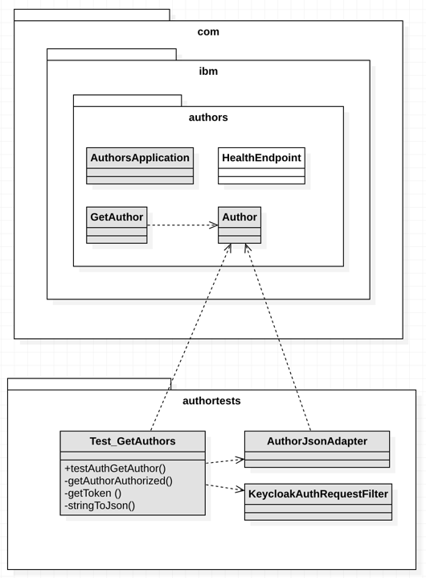

# Understand the JUnit test implementation

We need to ...

  1. ... use the two-factor authentication to access the `Authors` Microservice
  2. ... use a REST a client to send the requests to the `Authors` Microservice and Keycloak
  3. ... verify `Authors` Microservice response in the JUnit test

The simplified classdiagram shows an overview of classes of our project for the `Authors` Microservice and the `JUnit` test.

* `Test_GetAuthors` class implemments the test.
* `AuthorJsonbAdapter` class implemets the `JSON-B` adapter to convert `Author` objects to `JSON` format.
* `KeycloakAuthRequestFilter` implements [`ClientRequestFilter`](https://docs.oracle.com/javaee/7/api/javax/ws/rs/client/ClientRequestFilter.html) to simplify the creation of the REST client to access the Authors Microservice.

The JUnit test is implemented to do following tasks:

1. Use the two-factor authentication to access the `Authors Microservice`

  1. Request the `bearer token` from the Keycloak server. The request is implemented in the private `getToken` operation of the `Test_GetAuthors` class
  2. Use the `KeycloakAuthRequestFilter` interface implementation for a  `ClientRequestFilter`. `KeycloakAuthRequestFilter` does help to automatically build the needed parameter from `bearer-tokon response` of the `Keycloak` server. We need now to invoke the `Authors`Microservice with a _REST Client_ which contains the _bearer token_ we got from `Keycloak`. 
  3. Invoke the Authors Microservice from the private `getAuthorAuthorized` operation of the `Test_GetAuthors` class.

    1. Using a `WebTarget` to build a REST client to send the request to the Authors Microservice
    2. Create from JSON response of the `Authors Microservice` an `Author` Java object, using the JSON-B adapter class `AuthorJsonbAdapter`.

2. Verify the `Authors` Microservice response in the JUnit test

